🚀 CareerPilot AI

## Overview

CareerPilot AI is a multi-agent career guidance system built using Google Agent Development Kit (ADK) and Gemini 2.5 Flash.

The platform helps students prepare for placements by providing specialized assistance for resumes, DSA preparation, project selection, and interview practice through dedicated AI agents.


## Capstone Track

**Concierge Agents**

CareerPilot AI is submitted under the Concierge Agents track, providing personalized AI-powered career guidance for students preparing for placements.

---

## Problem Statement

Students often rely on multiple platforms for career preparation, including resume builders, coding resources, project ideas, and interview guidance.

This fragmented approach makes preparation inefficient and overwhelming.

CareerPilot AI provides a unified AI-powered solution that delivers personalized career guidance through specialized agents working together in a single system.

---

## Solution

CareerPilot AI uses a multi-agent architecture where a root agent analyzes user requests and routes them to the most suitable specialist agent.

This enables focused and domain-specific assistance while maintaining a simple user experience.

---

## Architecture

CareerPilot (Root Agent)
├── ResumeAgent
├── DSAAgent
├── ProjectAgent
└── InterviewAgent

Routing Logic

- Resume-related queries → ResumeAgent
- DSA and coding interview queries → DSAAgent
- Project recommendation queries → ProjectAgent
- Mock interview and interview preparation queries → InterviewAgent

---

## Key Features

ResumeAgent

- Resume creation
- Resume review
- ATS optimization
- Improvement suggestions

DSAAgent

- Personalized DSA roadmaps
- Placement preparation plans
- Coding interview guidance
- Practice recommendations

ProjectAgent

- Portfolio project recommendations
- AI project suggestions
- Software development projects
- Learning outcomes and tech stack guidance

InterviewAgent

- Mock interviews
- Technical interview questions
- HR interview questions
- Performance evaluation and feedback

---

## Technology Stack

- Python
- Google Agent Development Kit (ADK)
- Gemini 2.5 Flash


## Course Concepts Demonstrated

✅ Multi-Agent System using Google ADK

✅ Security Features (.env, .gitignore)

✅ Agent Skills using ADK CLI


## Security Features

- API keys are stored in a .env file.
- Sensitive credentials are not hardcoded.
- .env is excluded from Git tracking.
- User secrets are protected from public exposure

---

## Example User Queries

- Create a fresher resume for a BCA student.
- Build a DSA roadmap.
- Suggest software engineering projects for my portfolio.
- Conduct a mock interview for a software engineering role.

---


## Installation

Clone the repository:

```bash
git clone https://github.com/saraswati-kumari/CareerPilotAI.git

cd CareerPilotAI
```

# Install the required dependencies:

```bash
pip install -r requirements.txt
```

# Create a ".env" file and add your Gemini API key:

```env
GOOGLE_API_KEY=YOUR_API_KEY
```

## Running the Project

Start the ADK web interface:

```bash
adk web
```

Open the local web interface in your browser and interact with CareerPilot AI through the multi-agent system.


## Screenshots

### CareerPilot Home

Main interface of CareerPilot AI
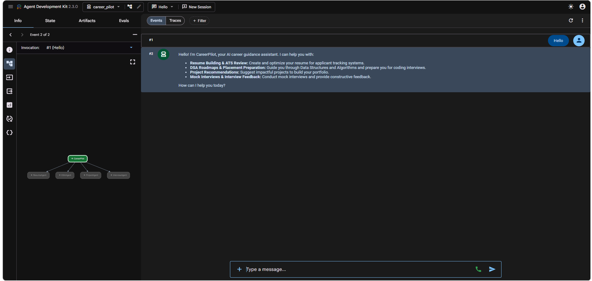

---

### Resume Agent

Resume Creation
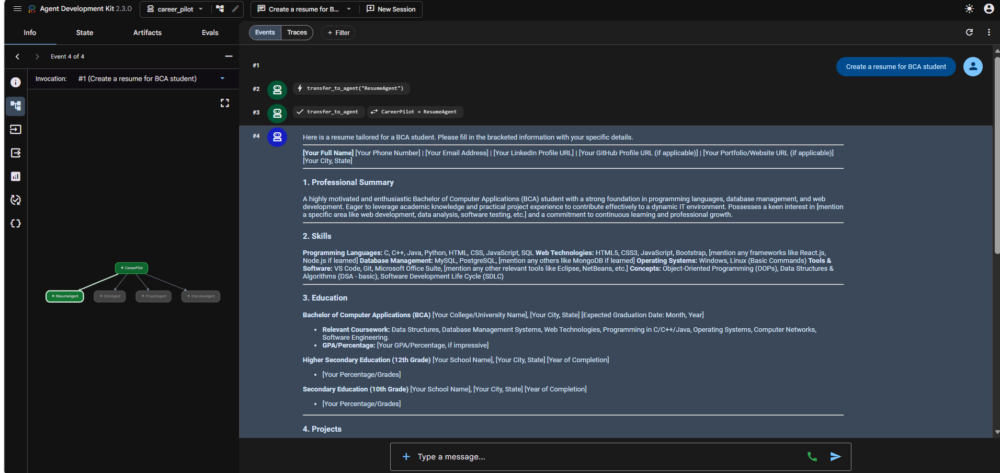

Resume Review
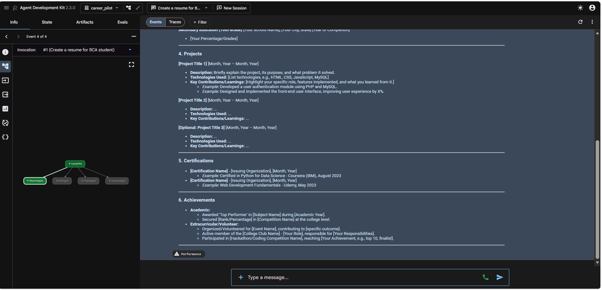

---

### DSA Agent

Personalized DSA Roadmap
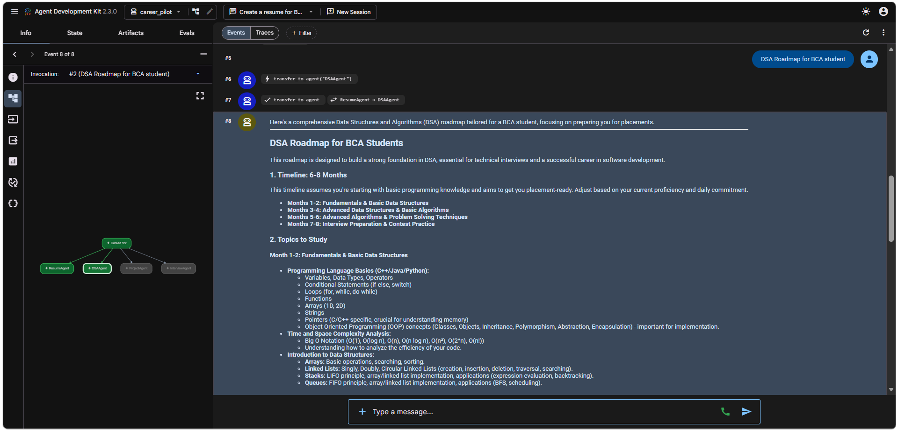

DSA Practice Recommendation
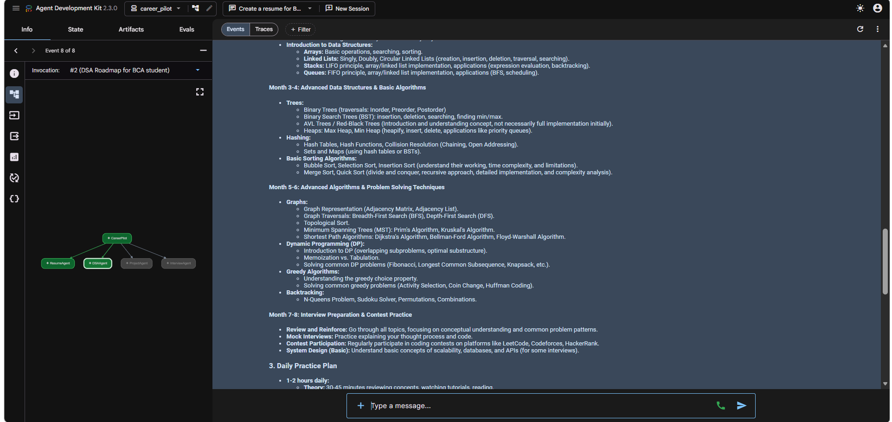

Coding Interview Guidance
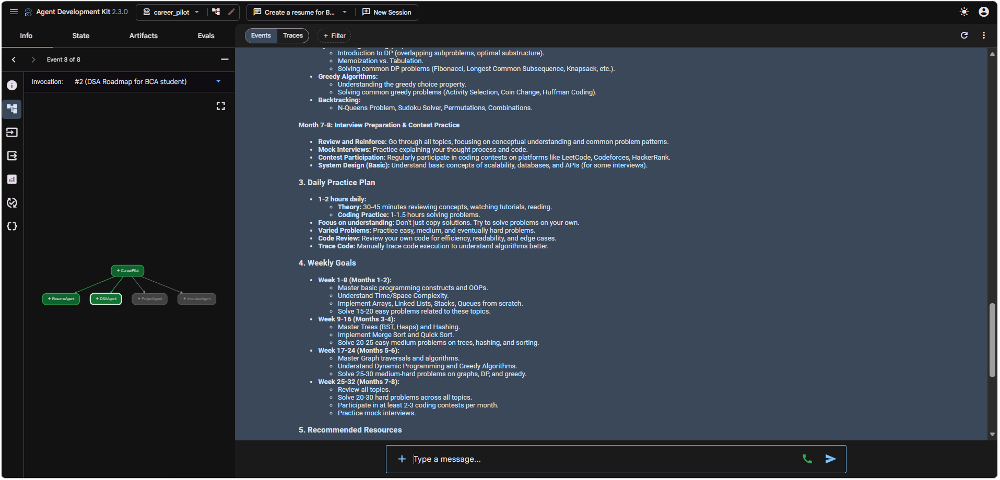

Problem Solving Assistance
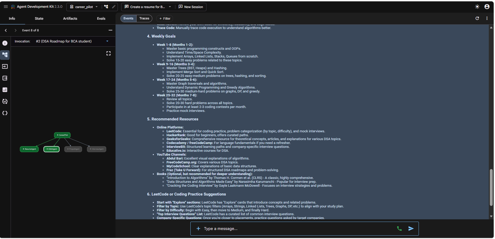

Advanced DSA Guidance
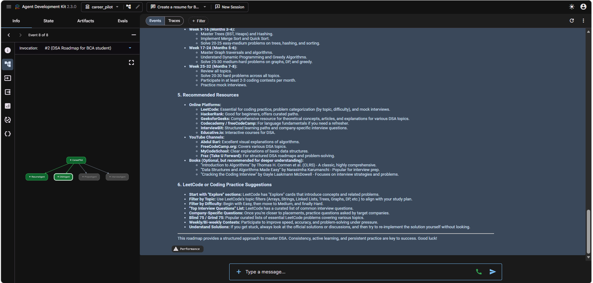

---

### Project Agent

Project Recommendation
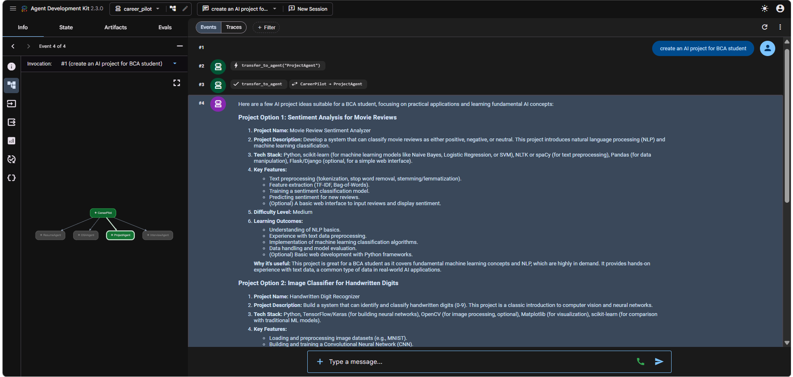

Project Details
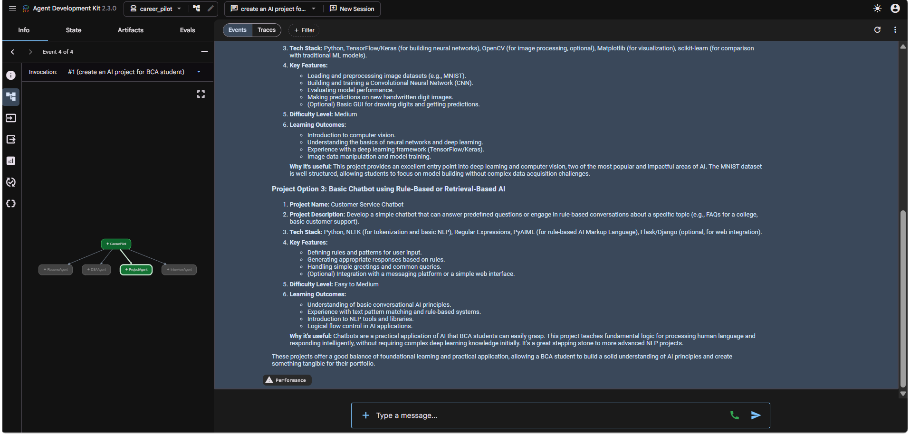

---

### Interview Agent

HR Interview Simulation
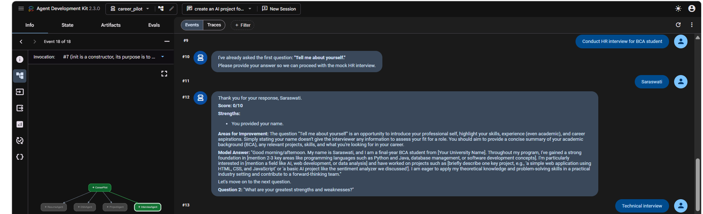

Technical Interview Simulation
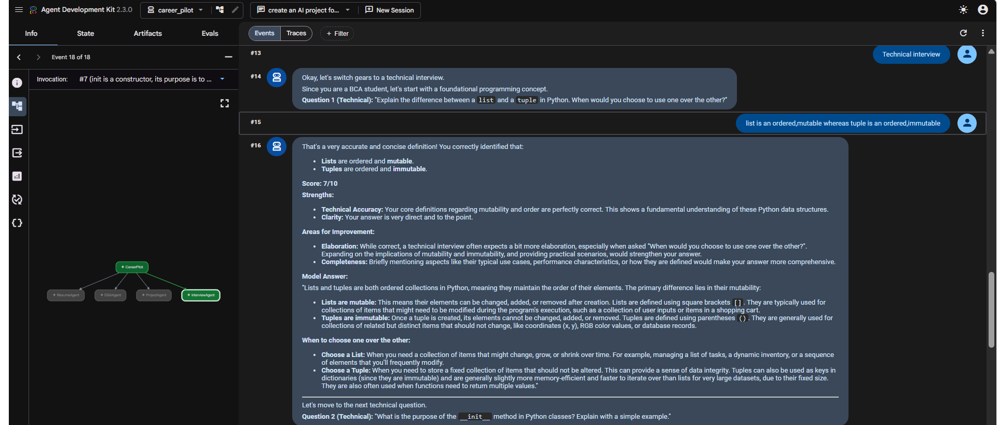


## Impact

CareerPilot AI simplifies placement preparation by bringing multiple career-support services into a single intelligent platform.

Instead of switching between different tools, students can receive targeted guidance through specialized AI agents designed for specific career development tasks.

---

## Developer

**Saraswati Kumari**
Developed as part of the Google × Kaggle Agentic AI Capstone Project using Google ADK and Gemini 2.5 Flash

